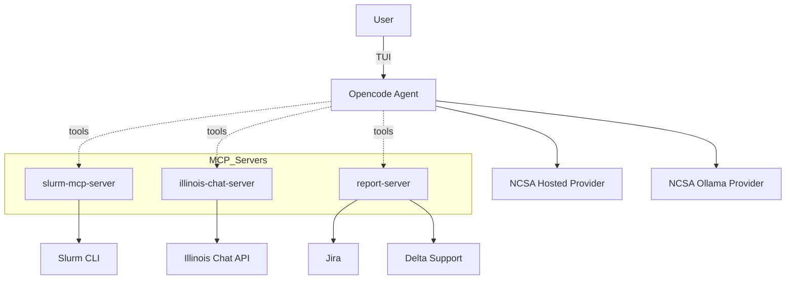

<p align="center">
  
</p>


This directory contains the NCSA deployment of hpcGPT. It integrates Model Context Protocol (MCP) servers for Slurm-based HPC environments, Illinois Chat documentation Q&A, and support reporting.

## TL;DR - Getting Started

```bash
curl -fsSL https://opencode.ai/install | bash
export OPENCODE_CONFIG=/absolute/path/to/this/repo/NCSA/opencode.jsonc
opencode
```

Set environment variables as needed (see Env section below), then pick a model and use tools from the TUI.

## Features

- Slurm integration (MCP): `accounts`, `sinfo`, `squeue`, and `scontrol` via `slurm-mcp-server`.
- Docs Q&A (MCP): Illinois Chat tools `query_delta_documentation`, `query_delta_ai_documentation`.
- Support reporting (MCP): `send_support_report` via `report-server`.
- Provider setup: NCSA Hosted provider configured in `opencode.jsonc`.
- Config-driven: Everything wired through `opencode.jsonc` for reproducibility.

## System Architecture



### How things fit together

- Opencode reads `NCSA/opencode.jsonc` for providers, models, and MCP servers.
- MCP servers expose tools over stdio; the agent calls them when the model chooses a tool.
- `slurm-mcp-server` shells out to local Slurm commands.
- `illinois-chat-server` calls the Illinois Chat API to answer questions from Delta/Delta AI docs.
- `report-server` creates Jira support tickets with session context.

## Project Structure

```text
NCSA/
  mcp_servers/
    illinois_chat_server/
      server.py
      requirements.txt
    slurm_server/
      server.py
      requirements.txt
    report_server/
      server.py
      requirements.txt
  prompts/
    support.txt
    report.txt
  opencode.jsonc
  example.env
  doc-scraping/
  README.md
```

## MCP Servers & Tools

- slurm-mcp (local)
  - Tools: `accounts`, `sinfo`, `squeue`, `scontrol`
  - Purpose: query accounts, node/partition status, user jobs, and job details.

- illinois-chat-mcp (local)
  - Tools: `query_delta_documentation`, `query_delta_ai_documentation`
  - Purpose: answer questions from Delta and Delta AI documentation.

- report-server (local)
  - Tools: `send_support_report`
  - Purpose: create Jira support issues with conversation history and host/user context.

## Installation

Install Opencode and point it at the NCSA config:

```bash
curl -fsSL https://opencode.ai/install | bash
export OPENCODE_CONFIG=/absolute/path/to/this/repo/NCSA/opencode.jsonc
opencode
```

### Optional: Local MCP server setup

MCP servers in `NCSA/mcp_servers/*` are Python services. From each server directory:

```bash
python -m venv .venv
source .venv/bin/activate
pip install -r requirements.txt
python server.py
```

Or run them as configured remote MCP endpoints from the `NCSA/opencode.jsonc` `mcp` section.

## Environment Configuration

Use `NCSA/example.env` as a reference and export values in your shell or `.env`.

### Core variables

- `NCSA_LLM_URL` - Base URL for NCSA Hosted models provider
- Illinois Chat and report server credentials are configured in each server's `config.json` (see `NCSA/mcp_servers/illinois_chat_server/example.config.json` and `NCSA/mcp_servers/report_server/example.config.json`).

## Usage Examples

Inside the Opencode TUI, pick a model (e.g., `ncsahosted/Qwen/Qwen3-VL-32B-Instruct`) and ask the assistant to use tools.

### Slurm status

"Check the Delta GPU partitions and my running jobs."

The assistant will call `sinfo` and `squeue` via `slurm-mcp-server`.

### Delta/Delta AI docs Q&A

"How do I submit a Slurm job on Delta?"

The assistant will call `query_delta_documentation` with your question and return a synthesized answer.

### File a support report

Run the `report` command in Opencode. This uses `send_support_report` to create a Jira support issue with context.

## Configuration Reference

See `NCSA/opencode.jsonc` for providers, models, and MCP server commands. Example provider entries:

```json
{
  "provider": {
    "ncsahosted": {
      "npm": "@ai-sdk/openai-compatible",
      "name": "my_provider_name",
      "options": {
        "baseURL": "{env:my_url}"
      },
      "models": {
        "Qwen/Qwen3-VL-32B-Instruct": {
          "name": "my_model_name",
          "options": {
            "stream": true
          }
        }
      }
    }
  }
}
```

## Links

- Delta Chatbot: `https://uiuc.chat/Delta-Documentation` (course: Delta-Documentation)
- Delta AI Chatbot: `https://uiuc.chat/DeltaAI-Documentation` (course: DeltaAI-Documentation)

## License

MIT - see `../LICENSE`.
