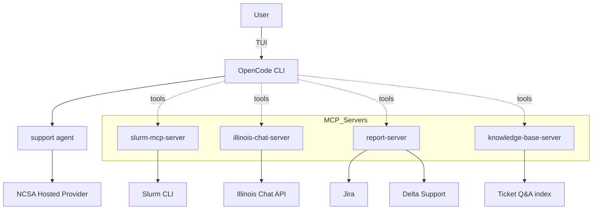

<p align="center">
  
</p>


This directory contains the NCSA deployment of hpcGPT for Delta. It provides a site-managed OpenCode installation with the Delta HPC support assistant configuration and Model Context Protocol (MCP) servers for querying Slurm, Illinois Chat documentation, ticket knowledge base and reporting tickets.

## TL;DR

**On Delta (end users):**

```bash
module load hpc-gpt/1.15.13
opencode
```

See [`client-deployment/README.md`](client-deployment/README.md) for site-admin install instructions.

**Local development:**

```bash
curl -fsSL https://opencode.ai/install | bash
export OPENCODE_CONFIG=/absolute/path/to/this/repo/NCSA/client-deployment/opencode.jsonc
export NCSA_LLM_URL=https://your-endpoint/v1
opencode
```

Set `NCSA_LLM_URL` and any MCP server credentials before starting (see Environment Configuration below).

## Features

- **Support agent** — Delta specific assistant with a custom system prompt (`client-deployment/prompts/support.txt`).
- **Slurm integration (MCP)** — `accounts`, `sinfo`, `squeue`, and `scontrol` via `slurm-mcp-server`.
- **Docs Q&A (MCP)** — Illinois Chat tools `query_delta_documentation` and `query_delta_ai_documentation`.
- **Support reporting (MCP)** — `send_support_report` via `report-server`; users can also run the `/report` command.
- **Ticket knowledge base (MCP)** — `search_tickets`, `get_ticket`, `list_clusters`, `get_cluster`, and `stats` via `knowledge-base-server` (`mcp_servers/ticket_server/`); indexes Q&A pairs produced by the `ticket-ingest/` pipeline.
- **Locked-down site config** — only the NCSA Hosted provider is enabled; built-in OpenCode agents (`build`, `plan`) are disabled.
- **Site deployment** — Environment Modules install with installer, modulefile, and config templates in `client-deployment/`.

## System Architecture



### How things fit together

- OpenCode reads `client-deployment/opencode.jsonc` (via `OPENCODE_CONFIG`) for providers, agents, and MCP servers.
- The **support** agent is the primary user-facing mode, configured with Delta-specific prompts and tool permissions.
- In production on Delta, MCP servers run as remote HTTP endpoints on `dt-hpcgpt` (ports 8001–8004 for Slurm, Illinois Chat, report, and knowledge-base). For local development, run the Python servers from `mcp_servers/` and point the config URLs at `http://127.0.0.1:<port>/mcp`.
- `slurm-mcp-server` shells out to local Slurm commands on the host where it runs.
- `illinois-chat-server` calls the Illinois Chat API to answer questions from Delta and Delta AI documentation.
- `report-server` creates Jira support tickets with session context.
- `knowledge-base-server` (`mcp_servers/ticket_server/`) indexes clustered support-ticket Q&A pairs and serves bm25 search over them. Data comes from the `ticket-ingest/` pipeline.

## Project Structure

```text
NCSA/
  client-deployment/       # Site install: installer, modulefile, config, prompts
    installer.sh
    module.lua
    opencode.jsonc
    prompts/
      support.txt
      report.txt
    README.md
  mcp_servers/
    slurm_server/
    illinois_chat_server/
    report_server/
    ticket_server/           
  ticket-ingest/             # Jira ticket → Q&A dataset pipeline
  doc-scraping/              # Delta documentation link lists
  example.env
  README.md
```

Each MCP server has its own README with setup and configuration details.

## MCP Servers & Tools

| Server | Tools | Purpose |
|--------|-------|---------|
| `slurm-mcp-server` | `accounts`, `sinfo`, `squeue`, `scontrol` | Query accounts, partitions, jobs, and job details |
| `illinois-chat-server` | `query_delta_documentation`, `query_delta_ai_documentation` | Answer questions from Delta and Delta AI docs |
| `report-server` | `send_support_report` | Create Jira support issues with conversation history and host/user context |
| `knowledge-base-server` | `search_tickets`, `get_ticket`, `list_clusters`, `get_cluster`, `stats` | bm25 search over processed support-ticket Q&A pairs |

## Installation

### Site deployment (Delta admins)

Use the artifacts in `client-deployment/` to install the OpenCode binary, deploy the site config and prompts, and register the Lmod modulefile. Full step-by-step instructions are in [`client-deployment/README.md`](client-deployment/README.md).

### Local development

Install OpenCode and point it at the NCSA config:

```bash
curl -fsSL https://opencode.ai/install | bash
export OPENCODE_CONFIG=/absolute/path/to/this/repo/NCSA/client-deployment/opencode.jsonc
export NCSA_LLM_URL=https://your-endpoint/v1
opencode
```

> **Note:** A personal OpenCode install in `~/.config/opencode` or `~/.opencode` can conflict with the site-wide module install. See the warning in [`client-deployment/README.md`](client-deployment/README.md) if you encounter startup errors on Delta.

### Local MCP server setup

MCP servers in `mcp_servers/` are Python services using Streamable HTTP. From each server directory:

```bash
python -m venv .venv
source .venv/bin/activate
pip install -r requirements.txt
cp example.config.json config.json   # edit as needed
python server.py
```

Update the `mcp` URLs in `client-deployment/opencode.jsonc` to point at your local instances (e.g. `http://127.0.0.1:8001/mcp`).

## Environment Configuration

Use `example.env` as a reference and export values in your shell or `.env`.

### Core variables

- `NCSA_LLM_URL` — Base URL for the NCSA Hosted models provider (set automatically by the Lmod module on Delta).
- `OPENCODE_CONFIG` — Path to the site or dev config file (set automatically by the Lmod module on Delta).

Illinois Chat and report server credentials are configured in each server's `config.json` (see `mcp_servers/illinois_chat_server/example.config.json`). The ticket knowledge base server points at a JSON file produced by `ticket-ingest/` via `data_dir` or `data_file` in `mcp_servers/ticket_server/example.config.json`.

## Usage Examples

After starting OpenCode, interact with the support agent and ask it to use tools as needed.

### Slurm status

"Check the Delta GPU partitions and my running jobs."

The assistant will call `sinfo` and `squeue` via `slurm-mcp-server`.

### Delta/Delta AI docs Q&A

"How do I submit a Slurm job on Delta?"

The assistant will call `query_delta_documentation` with your question and return a synthesized answer.

### Past support tickets

"Has anyone else had trouble getting GPU jobs to start on the gpuA100x4 partition?"

The assistant will call `search_tickets` (and optionally `get_ticket`) via `knowledge-base-server` to find similar resolved issues.

### File a support report

Run the `/report` command in OpenCode. This uses `send_support_report` to create a Jira support issue with context.

## Configuration Reference

The site config lives at `client-deployment/opencode.jsonc`. Key settings:

| Setting | Purpose |
|---------|---------|
| `enabled_providers` | Restricts the model picker to NCSA Hosted only |
| `agent` | Disables built-in `build` and `plan` agents |
| `mode.support` | Defines the Delta support agent (model, prompt, tools) |
| `provider.ncsahosted` | OpenAI-compatible provider using `{env:NCSA_LLM_URL}` |
| `mcp` | Remote MCP server URLs; toggle individual servers with `enabled` |
| `command.report` | Custom `/report` command bound to the support agent |
| `share` | Set to `"disabled"` on Delta |
| `permission` | Default tool permissions (`edit` and `bash` require approval) |

Example provider entry:

```json
{
  "provider": {
    "ncsahosted": {
      "npm": "@ai-sdk/openai-compatible",
      "name": "my_provider_name",
      "options": {
        "baseURL": "{env:my_url}"
      },
      "models": {
        "Qwen/Qwen3-VL-32B-Instruct": {
          "name": "my_model_name",
          "options": {
            "stream": true
          }
        }
      }
    }
  }
}
```

## Links

- Delta Chatbot: `https://uiuc.chat/Delta-Documentation` (course: Delta-Documentation)
- Delta AI Chatbot: `https://uiuc.chat/DeltaAI-Documentation` (course: DeltaAI-Documentation)
- OpenCode docs: [https://opencode.ai/docs](https://opencode.ai/docs)

## License

MIT — see [`../LICENSE`](../LICENSE).
